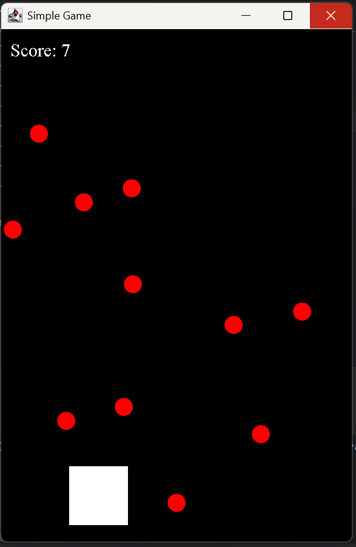
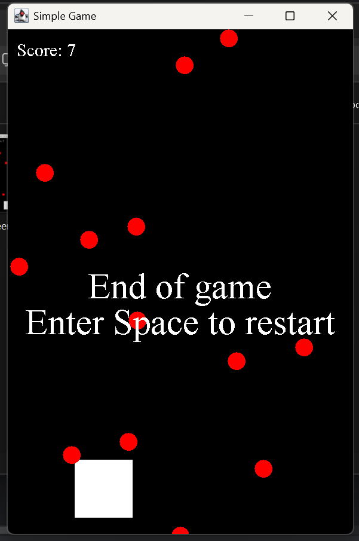
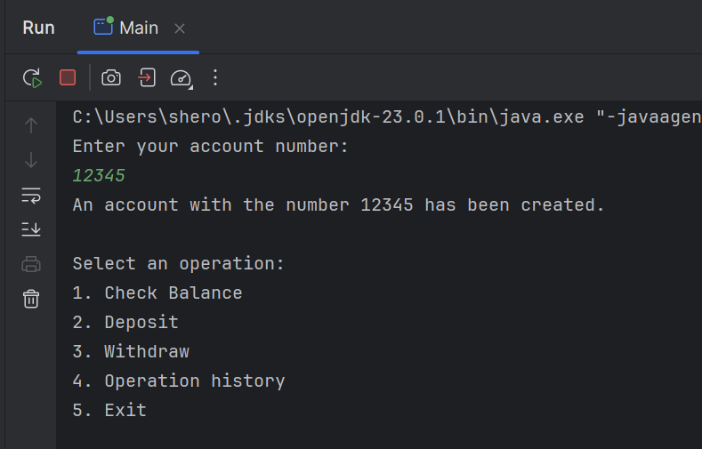

# Java-Projects

Привет! Это мой репозиторий с Java-проектами, которые я создал в процессе обучения и практики. Здесь вы найдете примеры моего кода, решения задач и небольшие приложения.

## Обо мне
Меня зовут Шевцов Роман, и я студент, изучающий Java. Я увлекаюсь разработкой на Java и активно изучаю новые технологии.

## Проекты
### 1. Простая игра на Java
- **Описание**: Игра, где игрок управляет квадратиком, избегая врагов.
- **Технологии**: Java, Swing.
- **Что я изучил**: Работа с графикой, обработка событий, игровой цикл.

## Скриншоты

*Игровой процесс: управление квадратиком и уклонение от врагов.*

*Экран завершения игры: возможность перезапустить игру.*

### 2. Система банкомата
- **Описание**: Лабораторная работа по созданию системы банкомата с использованием Maven и CI.
- **Технологии**: Java, Maven, GitHub Actions.
- **Что я изучил**: Настройка CI/CD, работа с Maven, разработка банковской системы.

## Скриншоты

*Меню разработанной программы с опциями.*