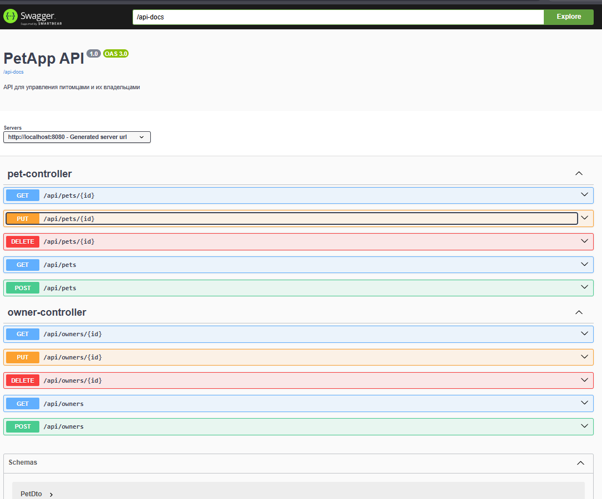
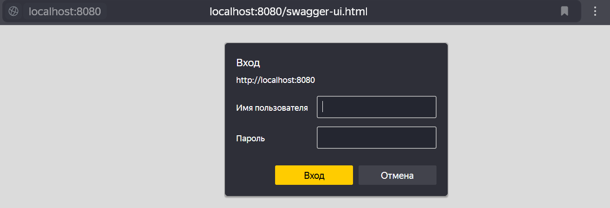
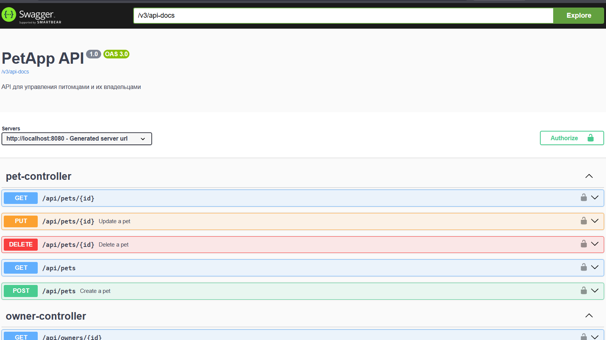

# Java-Projects

Привет! Это мой репозиторий с Java-проектами, которые я создал в процессе обучения и практики. Здесь вы найдете примеры моего кода, решения задач и небольшие приложения.

## Обо мне
Меня зовут Шевцов Роман, и я студент, изучающий Java. Я увлекаюсь разработкой на Java и активно изучаю новые технологии.

## Проекты
### 1. Простая игра на Java
- Описание: Игра, где игрок управляет квадратиком, избегая врагов.
- Технологии: Java, Swing.
- Что я изучил: Работа с графикой, обработка событий, игровой цикл.

## Скриншоты

*Игровой процесс: управление квадратиком и уклонение от врагов.*

*Экран завершения игры: возможность перезапустить игру.*

### 2. Система банкомата
- Описание: Лабораторная работа по созданию системы банкомата с использованием Maven и CI.
- Технологии: Java, Maven, GitHub Actions, JavaDoc, JUnit.
- Что я изучил: Настройка CI/CD, работа с Maven и JavaDoc, разработка банковской системы.

## Скриншоты

*Меню разработанной программы с опциями.*

### 3. Система управления домашними животными (архитектура DAO/Сервис/контроллер)
- Описание: Лабораторная работа по созданию системы управления питомцами с использованием ORM (Hibernate) и JDBC. Реализованы CRUD операции для сущностей "Питомец" и "Хозяин" с соблюдением архитектурного подхода Controller-Service-Dao
- Технологии: Java, Hibernate ORM, PostgreSQL, Docker, Maven, TestContainers (для интеграционного тестирования), JUnit 5
- Что я изучил: Работа с Hibernate и JDBC, реализация паттерна Controller-Service-Dao, написание интеграционных тестов с TestContainers, создание миграций базы данных

### 4. Веб-приложение для работы с котиками (Spring Boot + Spring Data JPA)
- Описание: Лабораторная работа по разработке REST API для управления информацией о питомцах и их владельцах с использованием Spring Boot и Spring Data JPA
- Технологии: Java 23, Spring Boot 3.2.5, Spring MVC, Spring Data JPA, PostgreSQL, H2 Database, SpringDoc OpenAPI 2.3.0 (Swagger UI), MapStruct 1.5.5.Final, Hibernate Validator, JUnit 5, Mockito 5.12.0, Hamcrest 2.2, Byte Buddy 1.15.0
- Что я изучил: Основы Spring Boot и Spring MVC, работу с Spring Data JPA и CrudRepository, создание REST API с правильной архитектурой, разделение сущностей JPA и DTO, документирование API с помощью Swagger, написание тестов для контроллеров без запуска сервера

#### Ключевые особенности:
- Реализованы REST endpoints для работы с питомцами и владельцами
- Использование DTO для передачи данных между клиентом и сервером
- Swagger документация API
- Покрытие unit-тестами с использованием MockMVC

## Скриншоты

*Swagger UI с документацией всех доступных endpoints*

### 5. Система аутентификации для приложения (Spring Security)
- Описание: Доработка веб-приложения с реализацией ролевой модели (администратор/пользователь) и защитой endpoints с помощью Spring Security 6.
- Технологии: Spring Boot, Spring Security 6, Role-based авторизация, SpringDoc OpenAPI (Swagger), MockMVC для тестирования
- Что я изучил: Настройка SecurityFilterChain, реализация ролевой модели, интеграция аутентификации в Swagger UI, тестирование защищенных endpoints, шифрование паролей

#### Ключевые особенности:
- Защита всех endpoints
- Проверка прав владельца
- Разделение доступа в Swagger UI по ролям
- Хранение паролей в защищенном виде

## Скриншоты

*Интеграция аутентификации в Swagger UI*